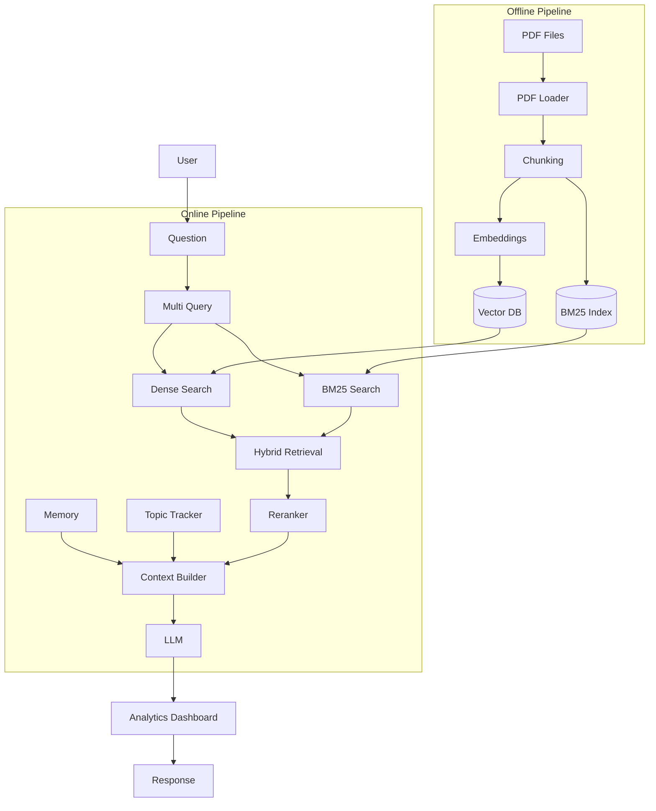
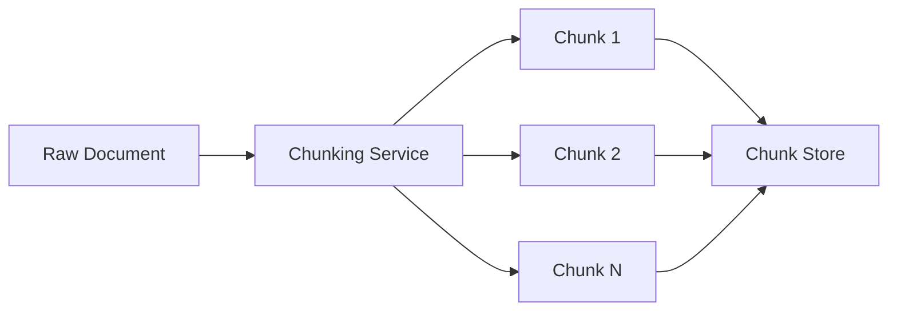
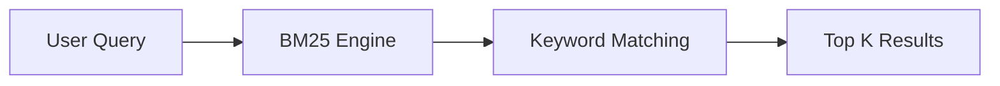
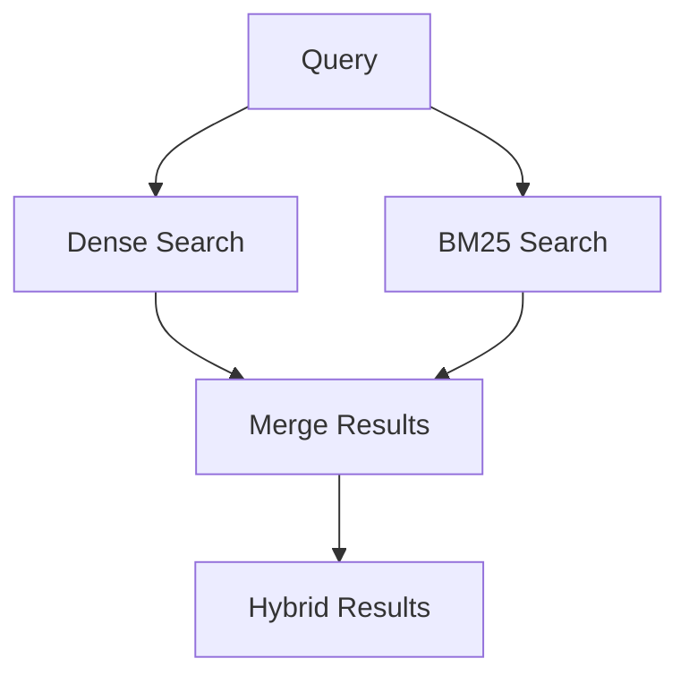
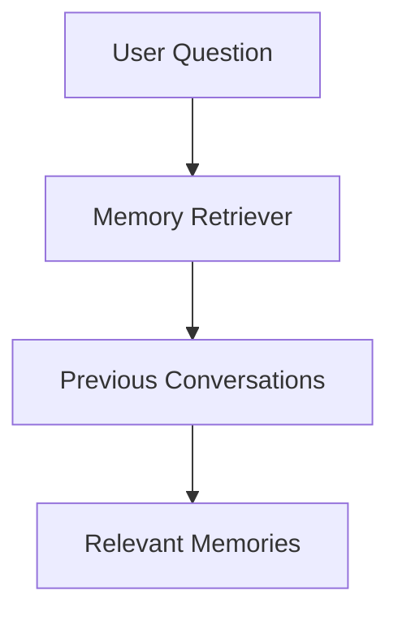
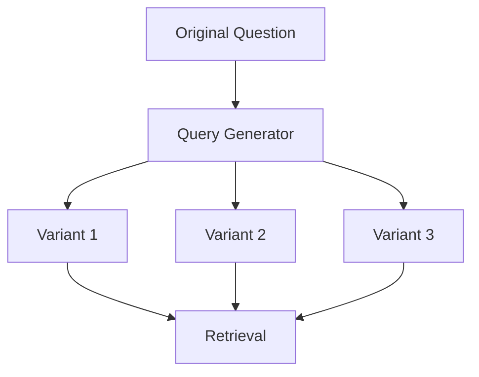
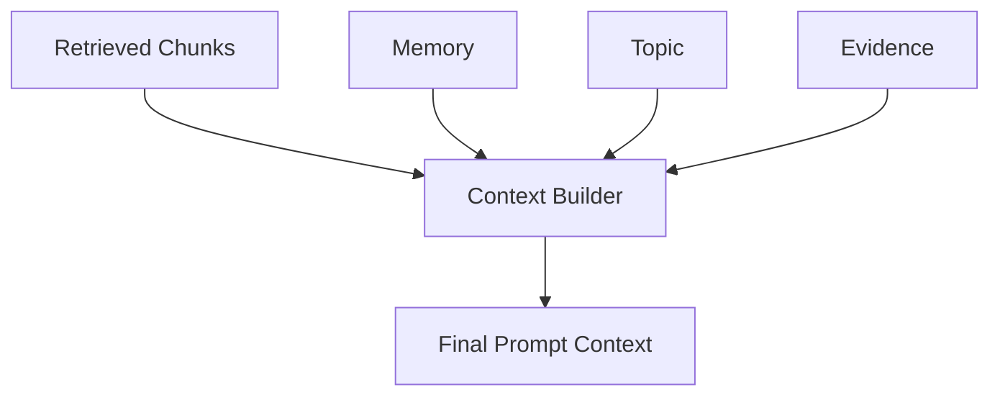
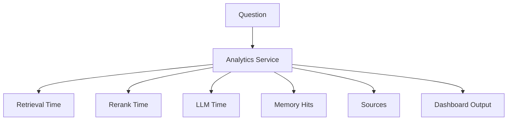

<h1 align="center"> CortexRAG </h1>

<h3>
  Memory-Augmented Hybrid Retrieval Intelligence Platform
</h3>

<b> 1. Designed and built a Memory-Augmented RAG system using FastAPI and LLMs.  
<b> 2. Implemented Hybrid Retrieval (Vector + Keyword Search), Multi-Query Expansion, and Cross-Encoder Reranking.  
<b> 3. Developed Knowledge Graph–based Query Expansion and Conversational Topic Tracking.  
<b> 4. Built Memory Retrieval, Memory Deduplication, and Context Compression pipelines.  
<b> 5. Created Retrieval Analytics Dashboard with latency, source, and retrieval-quality monitoring.  
<b> 6.  Integrated Evidence Extraction to optimize token usage and improve answer grounding.   

 

<h2 align="center"> Tech Stack </h2>

 

| Component            | Technology              | Strategy                       |
| -------------------- | ----------------------- | ------------------------------ |
| PDF Ingestion        | PDFPlumber              | Document Knowledge Extraction  |
| Chunking Engine      | Custom Chunker          | Context Preservation           |
| Embedding Generation | Sentence Transformers   | Semantic Encoding              |
| Vector Database      | FAISS                   | Dense Vector Retrieval         |
| Keyword Search       | BM25                    | Sparse Retrieval               |
| Hybrid Retrieval     | FAISS + BM25            | Retrieval Fusion               |
| Multi Query          | Query Expansion Service | Recall Improvement             |
| Knowledge Graph      | NetworkX                | Semantic Graph Expansion       |
| Reranking            | Cross Encoder           | Relevance Optimization         |
| Evidence Extraction  | Evidence Extractor      | Context Compression            |
| Memory Retrieval     | Memory Engine           | Long-Term Memory               |
| Topic Tracking       | Topic Tracker           | Conversational Context         |
| Memory Deduplication | Deduplicator            | Duplicate Prevention           |
| Context Builder      | Prompt Assembly Engine  | Context Aggregation            |
| Answer Generation    | Phi-3 Mini              | Retrieval-Augmented Generation |
| Analytics Dashboard  | Custom Analytics        | Pipeline Monitoring            |
| Backend Integration  | Spring Boot             | Enterprise API Integration     |
| Testing              | Postman                 | End-to-End Validation          |
| Version Control      | Git & GitHub            | Source Management              |

 

## Table of Contents

- [Project Structure](#project-structure)
- [Phase 01 - PDF Ingestion](#phase-01---pdf-ingestion)
- [Phase 02 - Chunking Engine](#phase-02---chunking-engine)
- [Phase 03 - Embedding Generation](#phase-03---embedding-generation)
- [Phase 04 - Vector Database](#phase-04---vector-database)
- [Phase 05 - Dense Retrieval](#phase-05---dense-retrieval)
- [Phase 06 - BM25 Retrieval](#phase-06---bm25-retrieval)
- [Phase 07 - Hybrid Retrieval](#phase-07---hybrid-retrieval)
- [Phase 08 - Cross Encoder Reranking](#phase-08---cross-encoder-reranking)
- [Phase 09 - Evidence Extraction](#phase-09---evidence-extraction)
- [Phase 10 - Memory System](#phase-10---memory-system)
- [Phase 11 - Topic Tracking](#phase-11---topic-tracking)
- [Phase 12 - Multi Query Expansion](#phase-12---multi-query-expansion)
- [Phase 13 - Context Builder](#phase-13---context-builder)
- [Phase 14 - Answer Generation](#phase-14---answer-generation)
- [Phase 15 - Analytics Dashboard](#phase-15---analytics-dashboard)
  
 
 

## Screenshots & Demonstrations
- [AI Layer](#ai-layer)
- [Hugging Face Dashboard](#huggingface)
- [Postman Testing](#postman)
- [Spring Boot Integration](#springboot)
- [RAG Analytics Dashboard](#rag-pipeline)

<h2 align="center"> Complete RAG Architecture </h2>

 
 

<h2 align="center"> Phase 01 • Data Ingestion </h2>

 <b> Purpose: </b> "Convert uploaded PDFs into raw textual knowledge." 
 

 
 

<h2 align="center"> Phase 02 • Chunking Engine </h2>

 <b> Purpose: </b> "Break large documents into searchable chunks" 

 
 

<h2 align="center"> Phase 03 • Embedding Generation </h2>

 <b> Purpose: </b> "Convert text into vector representations." 

 
 

<h2 align="center"> Phase 04 • Vector Database </h2>

 <b> Purpose: </b> "Store semantic representations for retrieval." 

 
 

<h2 align="center"> Phase 05 • Dense Retrieval </h2>

 <b> Purpose: </b> "Semantic similarity search." 

 
 

<h2 align="center"> Phase 06 • BM25 Retrieval </h2>

 <b> Purpose: </b> "Exact keyword retrieval." 

 
 

<h2 align="center"> Phase 07 • Hybrid Retrieval </h2>

 <b> Purpose: </b> "Combine semantic and keyword search." 

 
 

<h2 align="center"> Phase 08 • Cross Encoder Reranking </h2>

 <b> Purpose: </b> "Improve retrieval precision." 

 
 

<h2 align="center"> Phase 09 • Evidence Extraction </h2>

 <b> Purpose: </b> "Reduce unnecessary tokens." 

 
 

<h2 align="center"> Phase 10 • Memory System </h2>

 <b> Purpose: </b> "Maintain long-term conversation context." 

 
 

<h2 align="center"> Phase 11 • Topic Tracking </h2>

 <b> Purpose: </b> "Resolve follow-up questions like:
"Explain it?"
"Compare them?"" 

 
 

<h2 align="center"> Phase 12 • Multi Query Expansion </h2>

 <b> Purpose: </b> "Improve recall by generating multiple search queries." 

 
 

<h2 align="center"> Phase 13 • Context Builder </h2>

 <b> Purpose: </b> "Assemble everything before LLM generation." 

 
 

<h2 align="center"> Phase 14 • Answer Generation </h2>

 <b> Purpose: </b> "Generate grounded responses from retrieved knowledge." 

 
 

<h2 align="center"> Phase 15 • Analytics Dashboard </h2>

 <b> Purpose: </b> "Observe and evaluate RAG pipeline performance." 

 
 

<table align="center">

  <h2 align="center"> AI Layer • (FastAPI + RAG + LLM) </h2>

<tr>
<td>

 

<b>Document Ingestion</b>

</td>

<td>

 

<b>Chunks, Vector Storage, Collection Size (Meta Data)</b>

</td>
</tr>

<tr>
<td>

 

<b>Retrieval Pipeline Logs</b>

</td>

<td>

 

<b> Upload, Serach, Chat </b>

</td>
</tr>
</table>

 
 

<table align="center">

  <h2 align="center"> Hugging Face • (API Dashboard) </h2>

<tr>
<td>

 

<b> API Cost • Inference Dashboard </b>

</td>

<td>

 

<b> Phi-3-mini-4K • 3B+ </b>

</td>
</tr>

</table>

 
 

<table align="center">

  <h2 align="center"> PostMan Dashboard • Frontend (Testing) </h2>

<tr>
<td>

 

<b> /api/Chat 200K </b>

</td>

<td>

 

<b> User Query -01  </b>

</td>

<td>

 

<b> User Query - 02 </b>

</td>

</tr>
</table>

 
 
<table align="center">

  <h2 align="center"> Backend • (Spring Boot) </h2>

<tr>

<td>

 

<b> Spring Boot Connection with RAG Pipeline </b>

</td>

</tr>
</table>

 
 

<table align="center">
  <h2 align="center"> RAG Pipeline • (Metric Analysis Dashboard) </h2>
<tr>

<td>

 

 <b> Benchmark Testing, Metric Analysis </b> 

</td>

</tr>
</table>

 
 
