<h1> Knowledge Intelligence Engine (KIE) </h1>

<h3>
  Advanced Retrieval-Augmented Generation Platform
</h3>

<b> 1. Designed and built a Memory-Augmented RAG system using FastAPI and LLMs.  
<b> 2. Implemented Hybrid Retrieval (Vector + Keyword Search), Multi-Query Expansion, and Cross-Encoder Reranking.  
<b> 3. Developed Knowledge Graph–based Query Expansion and Conversational Topic Tracking.  
<b> 4. Built Memory Retrieval, Memory Deduplication, and Context Compression pipelines.  
<b> 5. Created Retrieval Analytics Dashboard with latency, source, and retrieval-quality monitoring.  
<b> 6.  Integrated Evidence Extraction to optimize token usage and improve answer grounding.   

## Table of Contents

- [Project Overview](#project-overview)
- [System Architecture](#system-architecture)
- [Tech Stack](#tech-stack)
- [Project Structure](#project-structure)
- [Phase 01 - PDF Ingestion](#phase-01---pdf-ingestion)
- [Phase 02 - Chunking Engine](#phase-02---chunking-engine)
- [Phase 03 - Embedding Generation](#phase-03---embedding-generation)
- [Phase 04 - Vector Database](#phase-04---vector-database)
- [Phase 05 - Dense Retrieval](#phase-05---dense-retrieval)
- [Phase 06 - BM25 Retrieval](#phase-06---bm25-retrieval)
- [Phase 07 - Hybrid Retrieval](#phase-07---hybrid-retrieval)
- [Phase 08 - Cross Encoder Reranking](#phase-08---cross-encoder-reranking)
- [Phase 09 - Evidence Extraction](#phase-09---evidence-extraction)
- [Phase 10 - Memory System](#phase-10---memory-system)
- [Phase 11 - Topic Tracking](#phase-11---topic-tracking)
- [Phase 12 - Multi Query Expansion](#phase-12---multi-query-expansion)
- [Phase 13 - Context Builder](#phase-13---context-builder)
- [Phase 14 - Answer Generation](#phase-14---answer-generation)
- [Phase 15 - Analytics Dashboard](#phase-15---analytics-dashboard)
- [Backend Screenshots](#backend-screenshots)
- [Testing Results](#testing-results)
- [Future Improvements](#future-improvements)

<h2 align="center"> Complete RAG Architecture </h2>

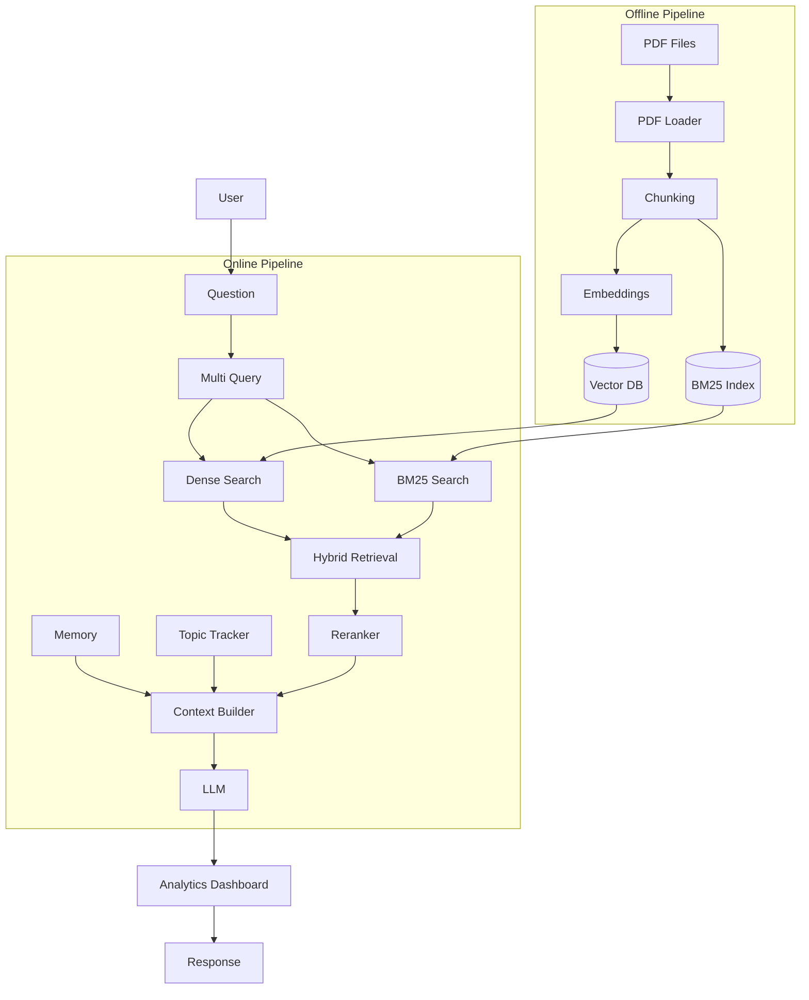

<h2 align="center"> Phase 02 • Chunking Engine </h2>

 <b> Purpose: </b> "Convert uploaded PDFs into raw textual knowledge." 

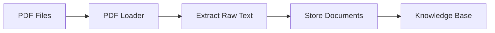

<h2 align="center"> Phase: 02 (Chunking Engine) </h2>

 <b> Purpose: </b> "Break large documents into searchable chunks" 

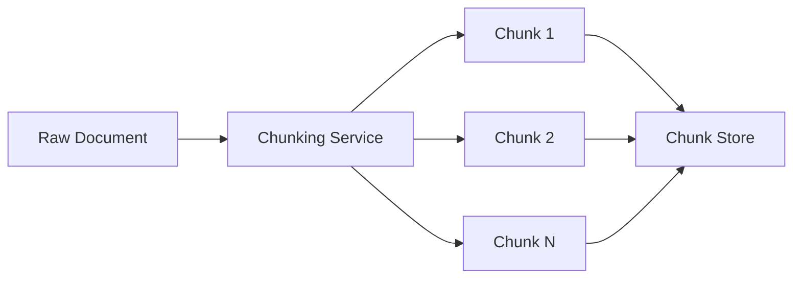

<h2 align="center"> Phase: 03 (Embedding Generation) </h2>

 <b> Purpose: </b> "Convert text into vector representations." 

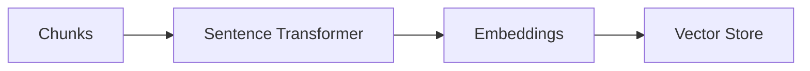

<h2 align="center"> Phase: 04 (Vector Database) </h2>

 <b> Purpose: </b> "Store semantic representations for retrieval." 

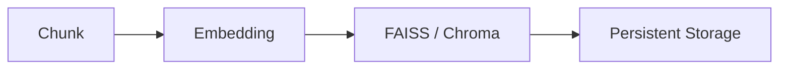

<h2 align="center"> Phase: 05 (Dense Retrieval) </h2>

 <b> Purpose: </b> "Semantic similarity search." 

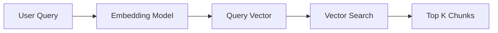

<h2 align="center"> Phase: 06 (BM25 Retrieval) </h2>

 <b> Purpose: </b> "Exact keyword retrieval." 

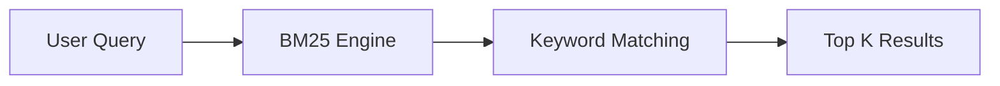

<h2 align="center"> Phase: 07 (Hybrid Retrieval) </h2>

 <b> Purpose: </b> "Combine semantic and keyword search." 

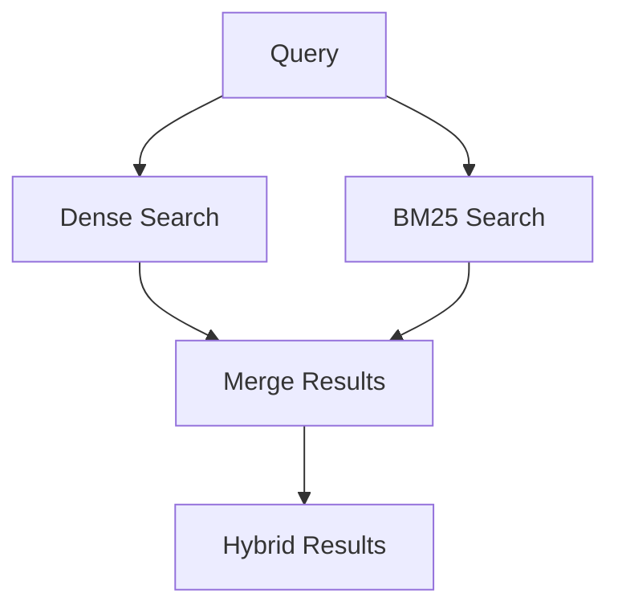

<h2 align="center"> Phase: 08 (Cross Encoder Reranking) </h2>

 <b> Purpose: </b> "Improve retrieval precision." 

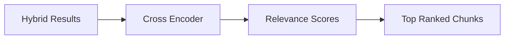

<h2 align="center"> Phase: 09 (Evidence Extraction) </h2>

 <b> Purpose: </b> "Reduce unnecessary tokens." 

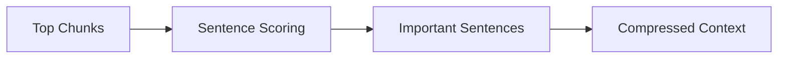

<h2 align="center"> Phase: 10 (Memory System) </h2>

 <b> Purpose: </b> "Maintain long-term conversation context." 

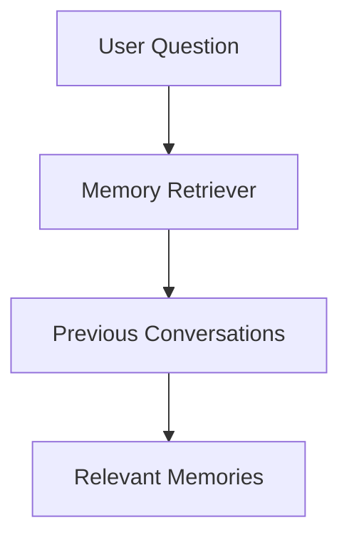

<h2 align="center"> Phase: 11 (Topic Tracking) </h2>

 <b> Purpose: </b> "Resolve follow-up questions like:
"Explain it?"
"Compare them?"" 

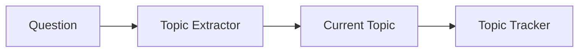

<h2 align="center"> Phase: 12 (Multi Query Expansion) </h2>

 <b> Purpose: </b> "Improve recall by generating multiple search queries." 

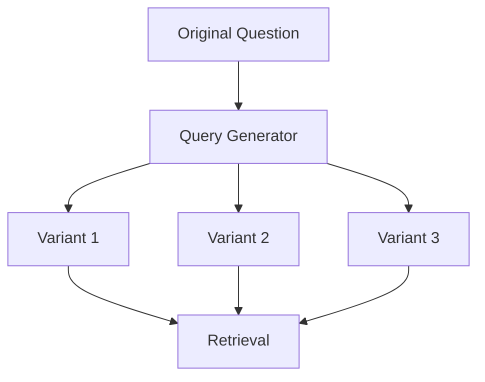

<h2 align="center"> Phase: 13 (Context Builder) </h2>

 <b> Purpose: </b> "Assemble everything before LLM generation." 

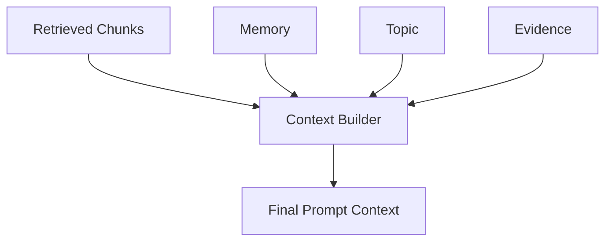

<h2 align="center"> Phase: 14 (Answer Generation) </h2>

 <b> Purpose: </b> "Generate grounded responses from retrieved knowledge." 

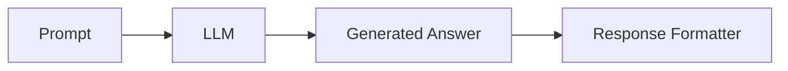

<h2 align="center"> Phase: 15 (Analytics Dashboard) </h2>

 <b> Purpose: </b> "Observe and evaluate RAG pipeline performance." 

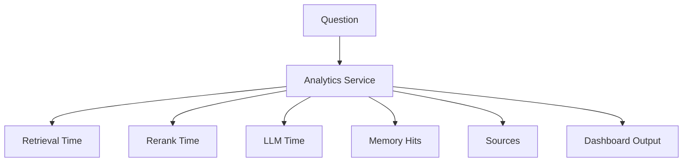

